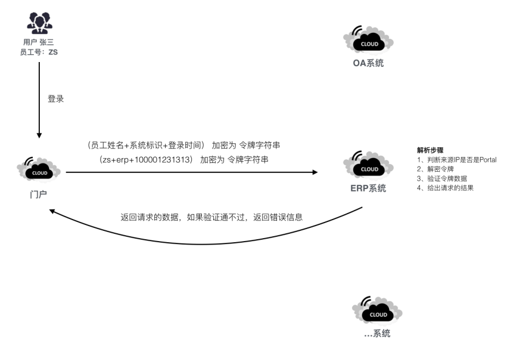

# 泛微OA单点集成

## 统一登录模式

基于统一门户平台实现企业统一身份管理，统一身份平台将为各被集成应用系统提供单点登录
流程描述： 第一次应用访问（上图中黑色流程）
1. 用户在统一门户中登录成功
2. 用户通过统一门户想取出ERP中相关的数据
3. 统一门户发送相关的业务请求并附带令牌字符串（相关的详细解释见后）
4. ERP系统收到请求后，通过解析令牌字符串来明确来访请求的身份
ERP返回请求的对应结果
   
## 统一登录设计说明
业务提供提供登录验证URL地址，统一门户将加密后的Token传递到提供的URL地址，业务系统收到token根据分配的秘钥进行解密，判断用户身份并进行登录系统的相关处理
1. 应用账户分配
统一门户会为每个接入统一门户的系统分配一个appid和秘钥key，将用户身份通过DES加密后生成token
| 参数名称 | 参数描述 |
| ------- | ------ |
| Appid | 应用唯一ID(系统分配) |
| Key | 认证需要的验证秘钥(系统分配) |
| pcurl | 异构系统PC端登录URL地址 |
| mobileurl | 异构系统移动端登录URL地址 |

2. Token生成
原加密字符串组成格式：人员编号+系统标识+时间戳 如：zs|erp|1521448142833
- 员工号
内部员工为员工号，外部人员为门户系统按统一规则分配，各系统必须将人员编号进行对应初始化。
- 系统标识
每个第三方业务系统的 APPID，如 erp,oa,crm等。此值为固定值
- 时间戳
此值为用户此次会话的当前时间，此值为以验证会话是否失效
- 字符串加密
字符串采用DES加密方式，每个系统标识分配一个加密秘钥，通过DES加密后得到Token

3. 身份验证规则
统一门户会根据异构系统提供的URL地址，将token传递过来，例如：
http://10.0.13.113/com/lzlj/OALogin.jsp? token=sdfasdfsddsfasdf&action=xxx
当请求到达各应用系统后，其步骤如下：
- 取出请求中的令牌字符串
通过统一门户传递过来的请求，获取token参数，根据分发的秘钥解密，获取到
员工编号、系统标识、时间戳，解密结果以“|”分割
a. 通过秘钥解密，验证token是否满足加密格式要求以及有效性
b. 根据系统标识判断，是否属于本系统请求
c. 根据时间戳判断请求时间有效性
- 根据员工号获取用户身份信息
根据解密后得到的员工编号，到对应系统中获取用户最终身份数据，进行相关业务处理
- 完成应用系统登录授权以及页面跳转
请求验证通过后，完成登录进入对应系统主界面或者跳转到指定页面
  
```java
package com.lzlj;

import java.io.IOException;

import javax.crypto.Cipher;
import javax.crypto.SecretKey;
import javax.crypto.SecretKeyFactory;
import javax.crypto.spec.DESKeySpec;
import javax.crypto.spec.IvParameterSpec;

import org.apache.commons.lang.StringUtils;

import sun.misc.BASE64Decoder;
import sun.misc.BASE64Encoder;

public class DesUtil {

	private final static String DES = "DES";
	// des 向量
	private static final byte[] byteIV = { 0x12, 0x34, 0x56, 0x78, (byte) 0x90,
			(byte) 0xab, (byte) 0xcd, (byte) 0xef };
	
	
	
	
	public static void main(String[] args) {
		try {
			System.out.println(encrypt("Admin", "_myhome_"));
			System.out.println(decrypt("XL0E2nT6DS8=","_myhome_"));
		} catch (Exception e) {
			// TODO Auto-generated catch block
			e.printStackTrace();
		}
	}
	
	/**
	 * Description DES加密
	 * 
	 * @param data
	 * @param key 加密键,必须8位以及以上
	 * @return
	 * @throws Exception
	 */
	public static String encrypt(String data, String key) throws Exception {
		
		if(StringUtils.isEmpty(data)){
			throw new Exception("加密字符串为空");
		}
		
		if(StringUtils.isEmpty(key)){
			throw new Exception("密钥为空");
		}
		
		if(key.length()!= 8){
			throw new Exception("密钥长度必须为8位");
		}
		
		byte[] bt = encrypt(data.getBytes("utf-8"), key.getBytes("utf-8"));
		String strs = new BASE64Encoder().encode(bt);
		return strs;
	}

	/**
	 * Description DES解密
	 * 
	 * @param data
	 * @param key 加密键,必须8位以及以上
	 * @return
	 * @throws IOException
	 * @throws Exception
	 */
	public static String decrypt(String data, String key) throws IOException,
			Exception {
		
		if(StringUtils.isEmpty(data)){
			throw new Exception("解密字符串为空");
		}
		
		if(StringUtils.isEmpty(key)){
			throw new Exception("密钥为空");
		}
		
		if(key.length()!= 8){
			throw new Exception("密钥长度必须为8位");
		}
		
		BASE64Decoder decoder = new BASE64Decoder();
		byte[] buf = decoder.decodeBuffer(data);
		byte[] bt = decrypt(buf, key.getBytes());
		return new String(bt, "utf-8");
	}

	/**
	 * Description 根据键值进行加密
	 * 
	 * @param data 加密byte数组
	 * @param key 加密键byte数组
	 * @return
	 * @throws Exception
	 */
	private static byte[] encrypt(byte[] data, byte[] key) throws Exception {
		// 生成一个可信任的随机数源
		IvParameterSpec iv = new IvParameterSpec(byteIV);
		// 从原始密钥数据创建DESKeySpec对象
		DESKeySpec dks = new DESKeySpec(key);
		// 创建一个密钥工厂，然后用它把DESKeySpec转换成SecretKey对象
		SecretKeyFactory keyFactory = SecretKeyFactory.getInstance(DES);
		SecretKey securekey = keyFactory.generateSecret(dks);
		// Cipher对象实际完成加密操作
		Cipher cipher = Cipher.getInstance("DES/CBC/PKCS5Padding");
		// 用密钥初始化Cipher对象
		cipher.init(Cipher.ENCRYPT_MODE, securekey, iv);
		return cipher.doFinal(data);
	}

	/**
	 * Description 根据键值进行解密
	 * 
	 * @param data 解密byte数组
	 * @param key 加密键byte数组
	 * @return
	 * @throws Exception
	 */
	private static byte[] decrypt(byte[] data, byte[] key) throws Exception {
		// 生成一个可信任的随机数源
		IvParameterSpec iv = new IvParameterSpec(byteIV);
		// 从原始密钥数据创建DESKeySpec对象
		DESKeySpec dks = new DESKeySpec(key);
		// 创建一个密钥工厂，然后用它把DESKeySpec转换成SecretKey对象
		SecretKeyFactory keyFactory = SecretKeyFactory.getInstance(DES);
		SecretKey securekey = keyFactory.generateSecret(dks);
		// Cipher对象实际完成解密操作
		Cipher cipher = Cipher.getInstance("DES/CBC/PKCS5Padding");
		// 用密钥初始化Cipher对象
		cipher.init(Cipher.DECRYPT_MODE, securekey, iv);
		return cipher.doFinal(data);
	}
}
```